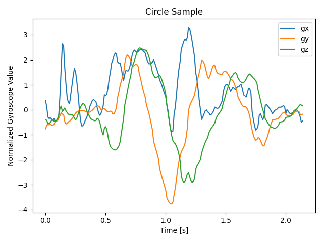
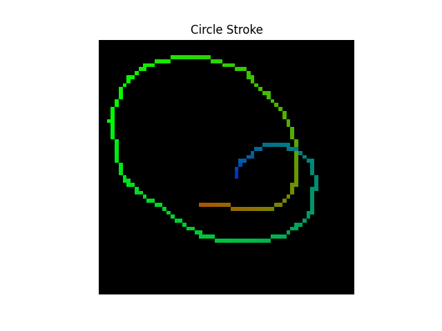

# Conductor ML


The hall falls silent.
As the curtains gently part, you step onto the podium—every eye in the room fixed on you. You bow before the audience, a gesture of grace and tradition.
Before you, the orchestra waits, poised in perfect stillness, ready to follow your lead.
With a single motion, your hand rises—and the music begins to breathe through your gestures.

With ConductorML, the baton is in your hands.
Command your own digital orchestra, where every section listens for your cue.
Using two Arduino Nano 33 boards, your gestures shape the music—guiding instruments, adjusting volume, and sculpting the dynamics in real time.
All of it unfolds through a custom-built web interface, where each instrument section is brought to life before your eyes.

## Table of Contents
1. [Team](#team)
2. [Idea](#idea)
3. [Overview](#overview)
4. [Models](#models)
5. [Arduino Sketch](#arduino)
6. [Frontend](#frontend)
7. [Setup](#setup)
8. [License](#license)

## Team

This project was developed as part of the TinyML course led by [Prof. Cristian Axenie](https://www.th-nuernberg.de/person/axenie-cristian/) at the Georg Simon Ohm University of Applied Sciences Nuremberg during the summer semester of 2025.
The team behind ConductorML consists of
- Eleonora Schubert, 3296062, schubertel75720@th-nuernberg.de
- Kristoph Kolert, 3128311, kolertkr103269@th-nuernberg.de
- Tan Phat Nguyen, 3818565, nguyenta100556@th-nuernberg.de
- Robin Feldmann, 3538270, feldmannro80685@th-nuernberg.de, 

united by a shared passion for music, technology, and creative experimentation.

## Idea

The core idea behind ConductorML is to use the onboard IMU (accelerometer and gyroscope) of the Arduino Nano 33 BLE to recognize hand gestures performed by the user.
The project draws inspiration from and builds upon the [Magic Wand](https://github.com/petewarden/magic_wand) repository by Peter Warden.

Instead of using raw accelerometer and gyroscope data directly for gesture classification, the system estimates the device’s orientation by integrating gyroscope data over time. It then tracks changes in orientation to approximate gesture movement. Using recent motion history, a 2D stroke representation of the gesture is extracted and rasterized into an image.

These 2D images are then classified into gesture categories by a small convolutional neural network, implemented using TensorFlow Lite for Microcontrollers. The model runs directly on the Arduino Nano 33 BLE’s onboard neural processing unit, enabling efficient, real-time inference on embedded hardware.
The classification result is transmitted to a central computer and displayed in a custom-built web interface. This interface not only visualizes the recognized gestures but also maps them to playback triggers and volume changes for different sections of the digital orchestra—enabling intuitive, real-time control through gesture alone.

## Overview

The following sections are organized to provide a clear overview of all the moving parts that make up our application:

1. [Models](#models)

    This section explains how our gesture classification models were developed—from the initial data collection and preprocessing steps to model architecture and training. It provides insight into the process of transforming raw IMU data into effective, deployable models.

2.  [Arduino Sketch](#arduino)

    Here we detail how the trained models are deployed on the Arduino Nano 33 BLE using TensorFlow Lite for Microcontrollers. You'll find information on real-time inference, onboard data preprocessing, and the Bluetooth communication setup used to transmit predictions and stroke data.

3.  [Frontend](#frontend)

    This part covers the code powering the web interface that brings everything together. It receives gesture classifications and stroke data via Bluetooth, maps them to musical actions, and controls both the audio playback and visual feedback of the digital orchestra.

## Models

Two Arduino Nano 33 BLE boards are used—one for each hand—with slightly different gesture sets. One device is responsible for instrument selection, while the other controls commands sent to the selected instrument (e.g., play, stop, volume).
The code is organized so that all model-related logic can be found in the following directories:

- [python_instrument](./python_instrument) – for the instrument-selection model

- [python_command ](./python_command)– for the command/execution model


### 1. Data Collection

Data was collected using a general procedure where both Arduinos were connected via Bluetooth. Gestures were recorded using either a simple web interface designed to log stroke data for training. 
Each recorded stroke consists of a sequence of points that define a gesture path, captured in normalized coordinates ranging from -1 to +1. These are later scaled and rasterized into image representations for training.
For each gesture, 100 samples were recorded.

The stroke data is saved as a JSON and has the following structure:
```python
class StrokePoint:
    """Represents a single point in a gesture stroke.
    Coordinates are normalized in the range [-1, 1] and must be scaled to match the resolution of the output 2D image.
    """
    x: float
    y: float

class Stroke:
    """Represents a single gesture stroke.
    The label is an integer corresponding to a specific gesture class,
    with the exact meaning depending on whether the stroke was recorded from the left or right device.
    """
    index: int
    strokePoints: list[StrokePoint]
    label: int

class StrokeData:
    strokes: List[Stroke]
``` 

The data for the [instrument-selection model is available here](./python_instrument/data), and the data for the [command-control model can be found here](./python_command/data).

The following example shows how raw gyroscope data is transformed during preprocessing.
This entire procedure—including orientation estimation and stroke rendering—is already performed on the Arduino, enabling efficient real-time gesture classification on-device.

Raw normalized data, recorded directly from the gyroscope:



Processed stroke image, after estimating device orientation through integration and rendering the gesture path as a 64×64 raster image:




### 2. Preprocessing and Data Augmentation

The full data pipeline—from loading and preprocessing to training—is documented in the following Jupyter notebooks:

- [Instrument Notebook](./python_instrument/train.ipynb)

- [Command Notebook](./python_command/train.ipynb)

Each notebook includes data loading, stroke rasterization, augmentation, model definition, training, and export to TensorFlow Lite format for deployment on the Arduino.

After loading the data from JSON files, each stroke is converted into a 32×32×3 image.
This is done by mapping the normalized IMU data to 2D coordinates and drawing colored lines between them based on stroke timing—using red, green, and blue to indicate the gesture's progression over time.

The data is then split into training, validation, and test sets.
To improve model robustness, the training set is augmented by applying random translation, scaling, and rotation. For each original training image, 10 augmented versions are generated.
All resulting images are saved in the corresponding data directories:

- [Instrument Data](./python_instrument/train) 

- [Command Data](./arduino_command/train)


### 3. Model Definition and Training

The model was built using TensorFlow and Keras with a simple convolutional architecture. It consists of three 2D convolutional layers:

- Conv1: 16 filters, kernel size 3, stride 2

- Conv2: 32 filters, kernel size 3, stride 2

- Conv3: 64 filters, kernel size 3, stride 2

A final dense layer is used for gesture classification.
BatchNormalization is applied after each convolutional layer for training stability, and Dropout is used to prevent overfitting:

```python
def make_model(input_shape: Tuple[int, int, int], num_classes: int) -> keras.Model:
    """
    Builds a convolutional neural network model using TensorFlow Keras.
    """
    # Input layer
    inputs = keras.Input(shape=input_shape)

    # Entry block
    x = layers.Rescaling(1.0 / 255)(inputs)
    x = layers.Conv2D(16, kernel_size=3, strides=2, padding="same")(x)
    x = layers.BatchNormalization()(x)
    x = layers.Activation("relu")(x)
    x = layers.Dropout(0.5)(x)

    x = layers.Conv2D(32, kernel_size=3, strides=2, padding="same")(x)
    x = layers.BatchNormalization()(x)
    x = layers.Activation("relu")(x)
    x = layers.Dropout(0.5)(x)

    x = layers.Conv2D(64, kernel_size=3, strides=2, padding="same")(x)
    x = layers.BatchNormalization()(x)
    x = layers.Activation("relu")(x)
    x = layers.Dropout(0.5)(x)

    # Global feature pooling
    x = layers.GlobalAveragePooling2D()(x)

    # Classifier block
    x = layers.Dropout(0.5)(x)
    outputs = layers.Dense(units=num_classes, activation="softmax")(x)

    # Construct model
    return keras.Model(inputs=inputs, outputs=outputs)
``` 

The model was trained for 30 epochs, using callbacks to monitor performance and apply early stopping based on validation loss. This helped prevent overfitting and ensured efficient training.

The following visualizations present the accuracy and classification performance of the trained model by using the command gestures as an example. The confusion matrix provides insight into how well each gesture is recognized.


After training, the model was converted into a TensorFlow Lite model and quantized to int8 for efficient deployment.
The quantized models are saved here:

- Instrument Model (links can only be added once we merge the repo)

- Command Model

In the final step, each model was converted into a C array (model.cc) to be included directly in the Arduino firmware.

## Arduino 

This section covers the firmware running on the two Arduino Nano 33 BLE boards.
Each board handles real-time IMU data processing, gesture recognition using a TensorFlow Lite model, and communication with the host computer via Bluetooth.

The corresponding Arduino sketches can be found here:

- [Instrument Arduino Code](./arduino_instrument)

- [Command Arduino Code](./arduino_command/)

Each Arduino directory includes the following key files:

-   [arduino_instrument.ino](./arduino_instrument/arduino_instrument.ino) / [instrument_command.ino](./arduino_command/arduino_command.ino):

    The main application loop that manages IMU data collection, preprocessing, gesture inference, and communication over serial and Bluetooth.

-   [rasterize_stroke.cpp](./arduino_command/rasterize_stroke.cpp):

    Responsible for converting normalized IMU data into 2D images through rasterization, preparing input for the model.

-   [model.cc](./arduino_command/model.cc):

    Contains the quantized TensorFlow Lite model as a C array, ready for inference on-device.

### Orientation Estimation

The IMU is configured in continuous mode with a default sampling rate of 119 Hz, which is also used in this project.
Gyroscope samples are buffered as they arrive. When the device is nearly stationary, a small batch of recent gyroscope readings is averaged to estimate and subtract sensor drift.

Each drift-corrected angular velocity is then multiplied by the inverse of the sample rate (Δt) and cumulatively integrated to update a running orientation vector for the X, Y, and Z axes.
This provides a simple estimate of orientation over time—sufficient for generating stroke paths—without fusing accelerometer data.

### Bluetooth Communication

Bluetooth is used to transmit both raw stroke data and inference results to the host system. Two characteristics are defined for this purpose:

-   strokeCharacteristic (Read Characteristic)
    Provides the list of stroke points in real time. This is used during data collection and to visualize the current gesture in the frontend.

-   predictionCharacteristic (Notify Characteristic)
    Sends the classification result of the on-device model inference as soon as it becomes available.

### Gesture Classification

A gesture is detected based on changes in estimated orientation.
When the cumulative change in orientation over the last 50 samples exceeds a defined threshold, gesture recording begins.
Once the movement falls back below the threshold and the recorded stroke reaches a minimum length, the gesture is considered complete.
At this point, the stroke is rasterized into an image, and inference is triggered using the on-device model.

## Frontend


The frontend is built with Nuxt, a framework based on Vue.js, and is designed to visualize gestures and control the digital orchestra in real time. It connects to the Arduino devices via Bluetooth, receives gesture predictions and stroke data, and maps these to instrument controls and visual feedback.

The core components include:

-  [index.vue](./app/pages/index.vue) – The landing view, introducing the user to the conductor experience.

-    [hall.vue](./app/components/hall.vue) – The main interface where instrument sections are displayed and gesture input is visualized.

-    [hall-audio.vue](./app/components/hall-audio.vue) – Manages audio playback logic for each instrument section based on gestures.

-    [draw-canvas.vue](./app/components/draw-canvas.vue) – Renders incoming stroke data on a canvas for real-time visualization.


## Setup

#### Prerequisites

Ensure the following are installed:

- [Node.js](https://nodejs.org/)
- [PNPM](https://pnpm.io/installation)
- [Arduino IDE](https://www.arduino.cc/en/software)
- [Python 3.12](https://www.python.org/downloads/)

#### Development Setup

**1. Clone the Repository:**

```bash
git clone https://github.com/TinyML-TH-Ohm/conductor.git
cd conductor
```

**2. Web Application Setup:**

Navigate to the project's root directory and execute:

```bash
pnpm install
pnpm dev
```

The web application will be accessible at [http://localhost:3000](http://localhost:3000).

**3. Arduino Setup:**

Connect your Arduino Nano 33 BLE Sense via USB.

Open the Arduino sketches located in [/arduino-instrument](/arduino-instrument) and [/arduino-command](/arduino-command) using the Arduino IDE.

Install the required Arduino libraries:

- [ArduinoBLE](https://docs.arduino.cc/libraries/arduinoble/) (via Library Manager)
- [Arduino_LSM9DS1](https://github.com/arduino-libraries/Arduino_LSM9DS1) (via Library Manager)
- [tflite-micro-arduino.zip](/tflite-micro-arduino.zip) (Add via `Sketch > Include Library > Add Zip Library`)

Upload the sketch to your Arduino board.

**4. Python Setup:**

Create and activate a virtual environment:

```bash
python -m venv .venv
# On Linux/macOS:
source ./.venv/bin/activate
# On Windows:
.\.venv\Scripts\activate.bat
```

Install Python dependencies:

```bash
pip install -r requirements.txt
```

Jupyter notebooks for model training are available in [/python_instrument](/python_instrument) and [/python_command](/python_command).


## License 
This project is licensed under the MIT License.

Permission is hereby granted, free of charge, to any person obtaining a copy of this software and associated documentation files (the “Software”), to deal in the Software without restriction, including without limitation the rights to use, copy, modify, merge, publish, distribute, sublicense, and/or sell copies of the Software, and to permit persons to whom the Software is furnished to do so, subject to the following conditions:

The above copyright notice and this permission notice shall be included in all copies or substantial portions of the Software.

THE SOFTWARE IS PROVIDED "AS IS", WITHOUT WARRANTY OF ANY KIND, express or implied, including but not limited to the warranties of merchantability, fitness for a particular purpose and noninfringement. In no event shall the authors or copyright holders be liable for any claim, damages or other liability, whether in an action of contract, tort or otherwise, arising from, out of or in connection with the software or the use or other dealings in the software.
